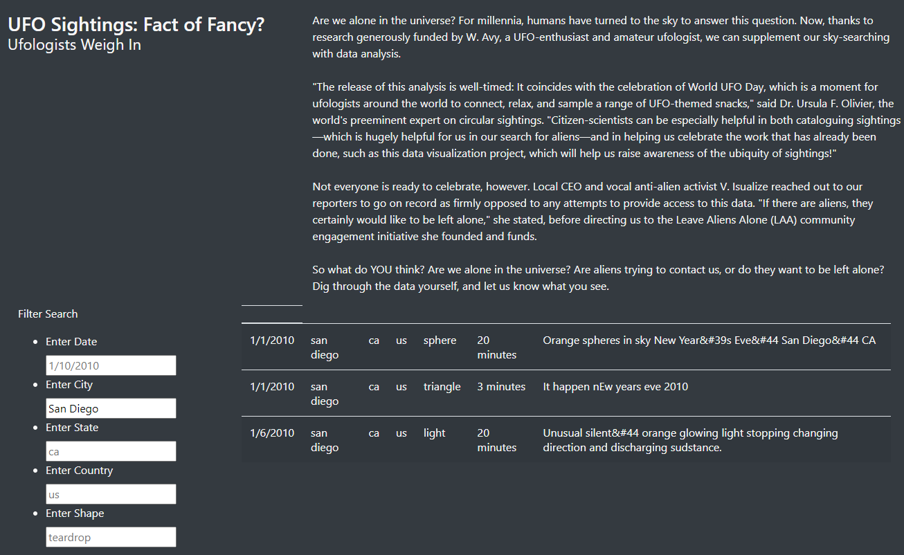

# ufos_js_UT_DATA

## Resources

- Data Source:
  - [Data (json)](./statics/js/data.js)

- Software:
  - NnodeJS 14.x
  - Visual Studio Code

## Purpose Overview

Dana’s webpage and dynamic table are working as intended, but she’d like to provide a more in-depth analysis of UFO sightings by allowing users to filter for multiple criteria at the same time. In addition to the date, you’ll add table filters for the city, state, country, and shape.

`ETL_create_database.ipynb`

## Results

In order to use this webpage and filtering system, users will input desired items into corresponding forms. It is advised to look a the unfiltered data first to determine appropiate styling of inputs, before users input filters into the forms. See three examples below with their descriptions for further guidance.

**Input 'San Diego' into City filter form**

**Input 'San Diego' into City filter form and 'US' into Country filter form**

**Removed 'San Diego' from City filter form and kept 'US' into Country filter form**

## Summary

Drawbacks of this filtering system:

- The filters are "dumb", meaning that they cannot distinguish between inputs such as 'Texas' and 'TX', or varying date formats.
- Recommend adding some logic to capture input data that shuold result in the same way ( i.e. 'TX' and 'Texas').
- Recommend adding further suggestions and guides for how users should put inputs (i.e. 'Date: M/D/YYYY')
